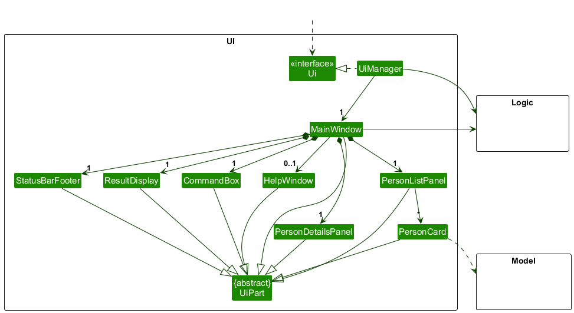
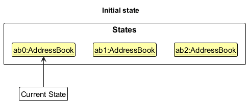
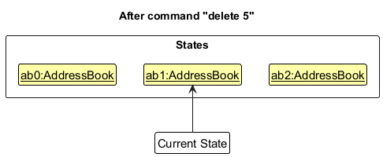
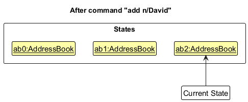
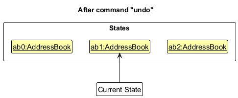
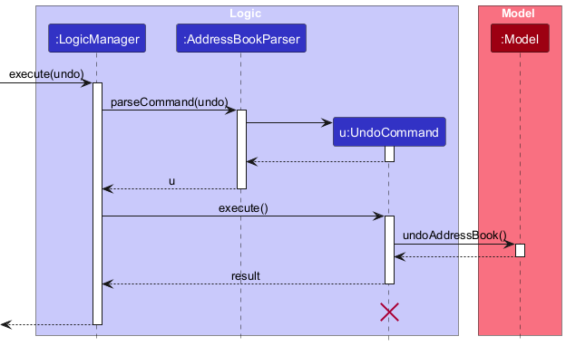
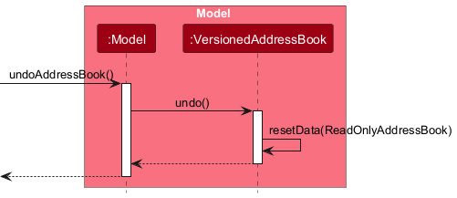
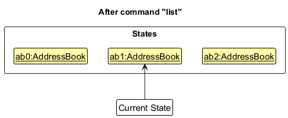
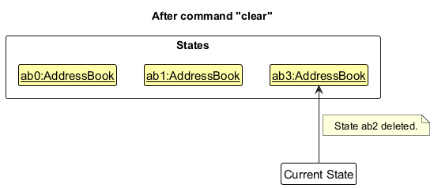

* Table of Contents
{:toc}

--------------------------------------------------------------------------------------------------------------------

## **Acknowledgements**

* {list here sources of all reused/adapted ideas, code, documentation, and third-party libraries -- include links to the original source as well}

--------------------------------------------------------------------------------------------------------------------

## **Setting up, getting started**

Refer to the guide [_Setting up and getting started_](SettingUp.md).

--------------------------------------------------------------------------------------------------------------------

## **Design**

:bulb: **Tip:** The `.puml` files used to create diagrams are in this document `docs/diagrams` folder. Refer to the [_PlantUML Tutorial_ at se-edu/guides](https://se-education.org/guides/tutorials/plantUml.html) to learn how to create and edit diagrams.

### Architecture

The ***Architecture Diagram*** given above explains the high-level design of the App.

Given below is a quick overview of main components and how they interact with each other.

**Main components of the architecture**

**`Main`** (consisting of classes [`Main`](https://github.com/se-edu/addressbook-level3/tree/master/src/main/java/seedu/address/Main.java) and [`MainApp`](https://github.com/se-edu/addressbook-level3/tree/master/src/main/java/seedu/address/MainApp.java)) is in charge of the app launch and shut down.
* At app launch, it initializes the other components in the correct sequence, and connects them up with each other.
* At shut down, it shuts down the other components and invokes cleanup methods where necessary.

The bulk of the app's work is done by the following four components:

* [**`UI`**](#ui-component): The UI of the App.
* [**`Logic`**](#logic-component): The command executor.
* [**`Model`**](#model-component): Holds the data of the App in memory.
* [**`Storage`**](#storage-component): Reads data from, and writes data to, the hard disk.

[**`Commons`**](#common-classes) represents a collection of classes used by multiple other components.

**How the architecture components interact with each other**

The *Sequence Diagram* below shows how the components interact with each other for the scenario where the user issues the command `delete 1`.

Each of the four main components (also shown in the diagram above),

* defines its *API* in an `interface` with the same name as the Component.
* implements its functionality using a concrete `{Component Name}Manager` class (which follows the corresponding API `interface` mentioned in the previous point.

For example, the `Logic` component defines its API in the `Logic.java` interface and implements its functionality using the `LogicManager.java` class which follows the `Logic` interface. Other components interact with a given component through its interface rather than the concrete class (reason: to prevent outside component's being coupled to the implementation of a component), as illustrated in the (partial) class diagram below.

The sections below give more details of each component.

### UI component

The **API** of this component is specified in [`Ui.java`](https://github.com/se-edu/addressbook-level3/tree/master/src/main/java/seedu/address/ui/Ui.java)

The UI consists of a `MainWindow` that is made up of parts e.g.`CommandBox`, `ResultDisplay`, `PersonListPanel`, `StatusBarFooter` etc. All these, including the `MainWindow`, inherit from the abstract `UiPart` class which captures the commonalities between classes that represent parts of the visible GUI.

The `UI` component uses the JavaFx UI framework. The layout of these UI parts are defined in matching `.fxml` files that are in the `src/main/resources/view` folder. For example, the layout of the [`MainWindow`](https://github.com/se-edu/addressbook-level3/tree/master/src/main/java/seedu/address/ui/MainWindow.java) is specified in [`MainWindow.fxml`](https://github.com/se-edu/addressbook-level3/tree/master/src/main/resources/view/MainWindow.fxml)

The `UI` component,

* executes user commands using the `Logic` component.
* listens for changes to `Model` data so that the UI can be updated with the modified data.
* keeps a reference to the `Logic` component, because the `UI` relies on the `Logic` to execute commands.
* depends on some classes in the `Model` component, as it displays `Person` object residing in the `Model`.

### Logic component

**API** : [`Logic.java`](https://github.com/se-edu/addressbook-level3/tree/master/src/main/java/seedu/address/logic/Logic.java)

Here's a (partial) class diagram of the `Logic` component:

The sequence diagram below illustrates the interactions within the `Logic` component, taking `execute("delete 1")` API call as an example.

:information_source: **Note:** The lifeline for `DeleteCommandParser` should end at the destroy marker (X) but due to a limitation of PlantUML, the lifeline continues till the end of diagram.

How the `Logic` component works:

1. When `Logic` is called upon to execute a command, it is passed to an `AddressBookParser` object which in turn creates a parser that matches the command (e.g., `DeleteCommandParser`) and uses it to parse the command.
1. This results in a `Command` object (more precisely, an object of one of its subclasses e.g., `DeleteCommand`) which is executed by the `LogicManager`.
1. The command can communicate with the `Model` when it is executed (e.g. to delete a person). 
   Note that although this is shown as a single step in the diagram above (for simplicity), in the code it can take several interactions (between the command object and the `Model`) to achieve.
1. The result of the command execution is encapsulated as a `CommandResult` object which is returned back from `Logic`.

Here are the other classes in `Logic` (omitted from the class diagram above) that are used for parsing a user command:

How the parsing works:
* When called upon to parse a user command, the `AddressBookParser` class creates an `XYZCommandParser` (`XYZ` is a placeholder for the specific command name e.g., `AddCommandParser`) which uses the other classes shown above to parse the user command and create a `XYZCommand` object (e.g., `AddCommand`) which the `AddressBookParser` returns back as a `Command` object.
* All `XYZCommandParser` classes (e.g., `AddCommandParser`, `DeleteCommandParser`, ...) inherit from the `Parser` interface so that they can be treated similarly where possible e.g, during testing.

### Model component
**API** : [`Model.java`](https://github.com/se-edu/addressbook-level3/tree/master/src/main/java/seedu/address/model/Model.java)

The `Model` component,

* stores the address book data i.e., all `Person` objects (which are contained in a `UniquePersonList` object).
* stores the currently 'selected' `Person` objects (e.g., results of a search query) as a separate _filtered_ list which is exposed to outsiders as an unmodifiable `ObservableList<Person>` that can be 'observed' e.g. the UI can be bound to this list so that the UI automatically updates when the data in the list change.
* stores a `UserPref` object that represents the user’s preferences. This is exposed to the outside as a `ReadOnlyUserPref` objects.
* does not depend on any of the other three components (as the `Model` represents data entities of the domain, they should make sense on their own without depending on other components)

:information_source: **Note:** An alternative (arguably, a more OOP) model is given below. It has a `Tag` list in the `AddressBook`, which `Person` references. This allows `AddressBook` to only require one `Tag` object per unique tag, instead of each `Person` needing their own `Tag` objects. 

### Storage component

**API** : [`Storage.java`](https://github.com/se-edu/addressbook-level3/tree/master/src/main/java/seedu/address/storage/Storage.java)

The `Storage` component,
* can save both address book data and user preference data in JSON format, and read them back into corresponding objects.
* inherits from both `AddressBookStorage` and `UserPrefStorage`, which means it can be treated as either one (if only the functionality of only one is needed).
* depends on some classes in the `Model` component (because the `Storage` component's job is to save/retrieve objects that belong to the `Model`)

### Common classes

Classes used by multiple components are in the `seedu.address.commons` package.

--------------------------------------------------------------------------------------------------------------------

## **Implementation**

This section describes some noteworthy details on how certain features are implemented.

### \[Proposed\] Undo/redo feature

#### Proposed Implementation

The proposed undo/redo mechanism is facilitated by `VersionedAddressBook`. It extends `AddressBook` with an undo/redo history, stored internally as an `addressBookStateList` and `currentStatePointer`. Additionally, it implements the following operations:

* `VersionedAddressBook#commit()` — Saves the current address book state in its history.
* `VersionedAddressBook#undo()` — Restores the previous address book state from its history.
* `VersionedAddressBook#redo()` — Restores a previously undone address book state from its history.

These operations are exposed in the `Model` interface as `Model#commitAddressBook()`, `Model#undoAddressBook()` and `Model#redoAddressBook()` respectively.

Given below is an example usage scenario and how the undo/redo mechanism behaves at each step.

Step 1. The user launches the application for the first time. The `VersionedAddressBook` will be initialized with the initial address book state, and the `currentStatePointer` pointing to that single address book state.

Step 2. The user executes `delete 5` command to delete the 5th person in the address book. The `delete` command calls `Model#commitAddressBook()`, causing the modified state of the address book after the `delete 5` command executes to be saved in the `addressBookStateList`, and the `currentStatePointer` is shifted to the newly inserted address book state.

Step 3. The user executes `add n/David …​` to add a new person. The `add` command also calls `Model#commitAddressBook()`, causing another modified address book state to be saved into the `addressBookStateList`.

:information_source: **Note:** If a command fails its execution, it will not call `Model#commitAddressBook()`, so the address book state will not be saved into the `addressBookStateList`.

Step 4. The user now decides that adding the person was a mistake, and decides to undo that action by executing the `undo` command. The `undo` command will call `Model#undoAddressBook()`, which will shift the `currentStatePointer` once to the left, pointing it to the previous address book state, and restores the address book to that state.

:information_source: **Note:** If the `currentStatePointer` is at index 0, pointing to the initial AddressBook state, then there are no previous AddressBook states to restore. The `undo` command uses `Model#canUndoAddressBook()` to check if this is the case. If so, it will return an error to the user rather
than attempting to perform the undo.

The following sequence diagram shows how an undo operation goes through the `Logic` component:

:information_source: **Note:** The lifeline for `UndoCommand` should end at the destroy marker (X) but due to a limitation of PlantUML, the lifeline reaches the end of diagram.

Similarly, how an undo operation goes through the `Model` component is shown below:

The `redo` command does the opposite — it calls `Model#redoAddressBook()`, which shifts the `currentStatePointer` once to the right, pointing to the previously undone state, and restores the address book to that state.

:information_source: **Note:** If the `currentStatePointer` is at index `addressBookStateList.size() - 1`, pointing to the latest address book state, then there are no undone AddressBook states to restore. The `redo` command uses `Model#canRedoAddressBook()` to check if this is the case. If so, it will return an error to the user rather than attempting to perform the redo.

Step 5. The user then decides to execute the command `list`. Commands that do not modify the address book, such as `list`, will usually not call `Model#commitAddressBook()`, `Model#undoAddressBook()` or `Model#redoAddressBook()`. Thus, the `addressBookStateList` remains unchanged.

Step 6. The user executes `clear`, which calls `Model#commitAddressBook()`. Since the `currentStatePointer` is not pointing at the end of the `addressBookStateList`, all address book states after the `currentStatePointer` will be purged. Reason: It no longer makes sense to redo the `add n/David …​` command. This is the behavior that most modern desktop applications follow.

The following activity diagram summarizes what happens when a user executes a new command:

#### Design considerations:

**Aspect: How undo & redo executes:**

* **Alternative 1 (current choice):** Saves the entire address book.
  * Pros: Easy to implement.
  * Cons: May have performance issues in terms of memory usage.

* **Alternative 2:** Individual command knows how to undo/redo by
  itself.
  * Pros: Will use less memory (e.g. for `delete`, just save the person being deleted).
  * Cons: We must ensure that the implementation of each individual command are correct.

_{more aspects and alternatives to be added}_

### \[Proposed\] Data archiving

_{Explain here how the data archiving feature will be implemented}_

--------------------------------------------------------------------------------------------------------------------

## **Documentation, logging, testing, configuration, dev-ops**

* [Documentation guide](Documentation.md)
* [Testing guide](Testing.md)
* [Logging guide](Logging.md)
* [Configuration guide](Configuration.md)
* [DevOps guide](DevOps.md)

--------------------------------------------------------------------------------------------------------------------

## **Appendix: Requirements**

### Product scope

**Target user profile**:

**Persona: Sarah, 29-year-old Freelance Wedding Planner in Singapore**

* Wedding planners who need to manage multiple clients and vendors simultaneously
* Freelance professionals who work independently but collaborate closely with vendors
* Has a need to manage a significant number of contacts (clients, florists, caterers, photographers, musicians, venues)
* Prefer desktop apps over other types for centralized information management
* Can type fast and prefer typing to mouse interactions
* Is reasonably comfortable using CLI apps
* Currently struggles with scattered information across WhatsApp, Excel, and paper notes
* Needs to track vendor information, quotes, and categorize them by type
* Manages multiple weddings at different stages of planning
* Experiences peak seasons with high stress and time pressure
* Requires quick retrieval of vendor details and client preferences
* Needs to track budgets with clarity and accuracy to avoid overspending

**Value proposition**: KnotBook solves the problem of scattered and inconsistent information management for wedding planners. It provides a centralized, fast, and reliable contact management system that eliminates the need to search across multiple platforms (WhatsApp, Excel, paper notes). Wedding planners can store and retrieve vendor and client information instantly, track event budgets with accuracy, and easily search, sort, and update information when plans change—all faster than typical mouse/GUI driven apps. This reduces lost time, minimizes stress during peak seasons, and prevents costly mistakes like double-booking vendors or overspending on budgets.

### User stories

Priorities: High (must have) - `* * *`, Medium (nice to have) - `* *`, Low (unlikely to have) - `*`

| Priority | As a …​                                    | I want to …​                                                      | So that I can…​                                                                      |
| -------- | ------------------------------------------ | ----------------------------------------------------------------- | ------------------------------------------------------------------------------------ |
| `* * *`  | new user                                   | see usage instructions                                            | refer to instructions when I forget how to use the App                               |
| `* * *`  | wedding planner                            | add a new contact with their details (name, type, price, phone)  | keep track of all vendors and clients involved in wedding planning                   |
| `* * *`  | wedding planner                            | delete a contact                                                  | remove entries that I no longer need                                                 |
| `* * *`  | wedding planner                            | view all contacts                                                 | see a complete list of all vendors and clients I'm working with                      |
| `* * *`  | wedding planner                            | categorize contacts by type (florist, caterer, photographer, etc.)| quickly filter and view contacts by their service category                           |
| `* * *`  | wedding planner                            | link each client to multiple vendors                              | track which vendors are assigned to which wedding events                             |
| `* * *`  | wedding planner                            | link each vendor to multiple clients                              | see which clients a particular vendor is serving                                     |
| `* * *`  | wedding planner                            | unlink a client from a vendor                                     | update relationships when vendors are changed or services are cancelled              |
| `* * *`  | wedding planner                            | find a contact by name                                            | quickly locate specific vendors or clients without scrolling through the entire list |
| `* * *`  | wedding planner                            | exit the program                                                  | close the application when I'm done working                                          |
| `* *`    | organized wedding planner                  | see contacts sorted alphabetically by name                        | locate contacts more easily in a predictable order                                   |
| `* *`    | budget-conscious wedding planner           | view the price of each vendor                                     | compare costs and stay within the wedding budget                                     |
| `* *`    | detail-oriented wedding planner            | store phone numbers for each contact                              | easily reach out to vendors and clients when needed                                  |
| `*`      | experienced wedding planner                | prevent duplicate contact names                                   | avoid confusion between different vendors or clients                                 |
| `*`      | wedding planner managing multiple events   | allow duplicate phone numbers and prices                          | accommodate cases where vendors share numbers or have similar pricing                |

### Use cases

(For all use cases below, the **System** is `KnotBook` and the **Actor** is the `user`, unless specified otherwise)

**Use case: UC01 - Delete a person**

**MSS**

1.  User requests to list persons
2.  KnotBook shows a list of persons
3.  User requests to delete a specific person in the list
4.  KnotBook deletes the person

    Use case ends.

**Extensions**

* 2a. The list is empty.

  Use case ends.

* 3a. The given index is invalid.

    * 3a1. KnotBook shows an error message.

      Use case resumes at step 2.

**Use case: UC02 - Link a vendor to a specific client**

**MSS**

1.  User requests to view all vendors
2.  KnotBook shows a list of vendors
3.  User searches for the specific vendor by name
4.  KnotBook displays the vendor's details
5.  User requests to view all clients
6.  KnotBook shows a list of clients
7.  User searches for the specific client by name
8.  KnotBook displays the client's details
9.  User requests to link the vendor to the client
10. KnotBook confirms the link and updates both records

    Use case ends.

**Extensions**

* 3a. The vendor name is not found.

    * 3a1. KnotBook shows an error message.

      Use case resumes at step 2.

* 7a. The client name is not found.

    * 7a1. KnotBook shows an error message.

      Use case resumes at step 6.

* 9a. The vendor is already linked to the client.

    * 9a1. KnotBook shows a warning message and asks for confirmation.
    * 9a2. User confirms the action.

      Use case resumes at step 10.

**Use case: UC03 - Categorize a vendor by type**

**MSS**

1.  User requests to add a new vendor
2.  KnotBook prompts for vendor details
3.  User enters vendor name, contact information, and category type (e.g., florist, caterer, photographer)
4.  KnotBook validates the information
5.  KnotBook saves the vendor with the specified category
6.  KnotBook displays success message

    Use case ends.

**Extensions**

* 3a. User enters invalid or incomplete information.

    * 3a1. KnotBook shows an error message specifying which fields are invalid.

      Use case resumes at step 2.

* 3b. User enters an unknown category type.

    * 3b1. KnotBook shows a list of valid category types.
    * 3b2. User selects a valid category or creates a new one.

      Use case resumes at step 4.

**Use case: UC04 - Update vendor quote**

**MSS**

1.  User requests to view all vendors or searches for a specific vendor
2.  KnotBook displays the list of vendors or search results
3.  User selects a vendor to view details
4.  KnotBook displays vendor details including current quote
5.  User requests to update the quote with new pricing
6.  KnotBook prompts for the new quote amount
7.  User enters the new quote
8.  KnotBook validates and saves the updated quote
9.  KnotBook displays confirmation message

    Use case ends.

**Extensions**

* 2a. No vendors found.

    * 2a1. KnotBook shows a message indicating no vendors exist.

      Use case ends.

* 7a. User enters invalid quote amount (e.g., negative number, non-numeric).

    * 7a1. KnotBook shows an error message.

      Use case resumes at step 6.

**Use case: UC05 - Add a new contact (detailed with validation)**

**MSS**

1.  User enters the add command with contact details (name, type, phone, email, and type-specific fields)
2.  KnotBook validates the name format
3.  KnotBook validates the type is either "client" or "vendor"
4.  KnotBook validates the phone number format (8-digit Singapore number)
5.  KnotBook validates the email format
6.  If type is "client", KnotBook validates the wedding date and budget
7.  If type is "vendor", KnotBook validates the category and price
8.  KnotBook checks for duplicate contacts (same phone or email)
9.  KnotBook saves the new contact
10. KnotBook displays success message

    Use case ends.

**Extensions**

* 2a. Invalid name format (contains special characters).

    * 2a1. KnotBook shows error: "Invalid name. Names should only contain alphanumeric characters and spaces."

      Use case ends.

* 3a. Invalid type (not "client" or "vendor").

    * 3a1. KnotBook shows error: "Invalid type. Please choose either 'client' or 'vendor'."

      Use case ends.

* 4a. Invalid phone number format.

    * 4a1. KnotBook shows error: "Invalid phone number. Input an 8-digit SG number."

      Use case ends.

* 5a. Invalid email format.

    * 5a1. KnotBook shows error: "Invalid email address format."

      Use case ends.

* 6a. Client added without wedding date.

    * 6a1. KnotBook shows error: "Wedding date is required for clients. Example: date:2025-10-12"

      Use case ends.

* 6b. Invalid date format.

    * 6b1. KnotBook shows error: "Invalid wedding date. Use DD/MM/YYYY (e.g., 12/10/2025)"

      Use case ends.

* 6c. Invalid budget format.

    * 6c1. KnotBook shows error: "Invalid amount. Provide a number or a range like 800-1500."

      Use case ends.

* 7a. Invalid category format for vendor.

    * 7a1. KnotBook shows error: "Invalid category. Use letters, numbers, spaces, or hyphens."

      Use case ends.

* 7b. Invalid price format for vendor.

    * 7b1. KnotBook shows error: "Invalid amount. Provide a number or a range like 800-1500."

      Use case ends.

* 8a. Duplicate contact detected (same phone or email).

    * 8a1. KnotBook shows error: "This contact already exists."

      Use case ends.

### Non-Functional Requirements

1.  **Portability**: Should work on any _mainstream OS_ as long as it has Java `17` or above installed.
2.  **Performance**: Should be able to hold up to 1000 contacts without noticeable sluggishness in performance for typical usage.
3.  **Usability**: A user with above average typing speed for regular English text (i.e. not code, not system admin commands) should be able to accomplish most of the tasks faster using commands than using the mouse.
4.  **Reliability**: The system should not lose data in case of unexpected application crashes.
5.  **Data Integrity**: The system should prevent duplicate entries (contacts with the same phone number OR email) from being added.
6.  **Privacy**: Client and vendor information should be stored locally on the user's machine and not transmitted over any network.
7.  **Usability**: Error messages should be clear and informative, guiding users on how to correct their input.
8.  **Compatibility**: Should work without requiring an internet connection (offline-first design).

### Glossary

* **KnotBook**: The name of this wedding planner contact management application
* **Mainstream OS**: Windows, Linux, Unix, MacOS
* **Private contact detail**: A contact detail that is not meant to be shared with others
* **AddressBook**: The main application for managing contacts
* **Command**: An instruction from the user to perform a specific operation (e.g., add, delete, find)
* **Parser**: A component that interprets user input and converts it into executable commands
* **Model**: The component that holds the application's data in memory
* **UI (User Interface)**: The visual component of the application that users interact with
* **Logic**: The component responsible for executing commands and coordinating between UI and Model
* **Storage**: The component that handles reading from and writing to persistent storage (JSON files)
* **Person**: An entity representing a contact with attributes like name, phone, email, address, and tags
* **Tag**: A label that can be attached to a Person for categorization
* **ObservableList**: A list that notifies observers when its contents change, used for UI updates
* **JavaFX**: The UI framework used to build the graphical interface
* **FXML**: A markup language used to define JavaFX UI layouts
* **JSON**: JavaScript Object Notation – the file format used for data persistence
* **Gradle**: The build automation tool used for compiling, testing, and packaging the application
* **PlantUML**: A tool for creating UML diagrams from text descriptions
* **JAR (Java Archive)**: A package file format used to distribute Java applications
* **CheckStyle**: A development tool to help ensure Java code adheres to a coding standard
* **Sequence Diagram**: A UML diagram showing how objects interact in a particular sequence
* **Class Diagram**: A UML diagram showing the structure of classes and their relationships
* **Vendor**: A service provider for weddings (e.g., florist, caterer, photographer, venue, DJ, makeup artist, musician)
* **Client**: A person or couple who is planning a wedding and has hired the wedding planner
* **Contact**: A general term referring to either a vendor or a client in the system
* **Quote/Price**: A pricing estimate provided by a vendor for their services; can be a single value or a range (e.g., 1000-3000)
* **Wedding planner**: The target user of this application; a professional who manages and coordinates weddings for clients
* **Category/Type**: A classification for contacts based on their role (client) or service they provide (florist, caterer, photographer, musician, venue, etc.)
* **Link**: An association between a vendor and a client, indicating that the vendor has been hired for that client's wedding. Both clients and vendors can have multiple links.
* **Unlink**: The action of removing an existing association between a vendor and a client
* **Budget**: The total amount of money allocated by a client for their wedding; can be a single value or a range
* **Index**: A positive integer representing the position of a contact in the currently displayed list
* **Wedding Date**: The date when a client's wedding is scheduled to take place; required for all client contacts
* **Task**: A to-do item or milestone in the wedding planning process (e.g., "venue booked", "deposit paid")
* **Note**: Additional information or preferences recorded for a client or vendor
* **Wedding status**: The current state of a wedding (e.g., upcoming, in-progress, completed)
* **CLI**: Command Line Interface - a text-based interface where users type commands to interact with the application
* **MSS**: Main Success Scenario - the primary flow of events in a use case when everything proceeds normally
* **Duplicate Contact**: A contact with the same phone number OR email as an existing contact in the system

--------------------------------------------------------------------------------------------------------------------

## **Appendix: Instructions for manual testing**

Given below are instructions to test the app manually.

:information_source: **Note:** These instructions only provide a starting point for testers to work on;
testers are expected to do more *exploratory* testing.

### Launch and shutdown

1. Initial launch

   1. Download the jar file and copy into an empty folder

   1. Double-click the jar file Expected: Shows the GUI with a set of sample contacts. The window size may not be optimum.

1. Saving window preferences

   1. Resize the window to an optimum size. Move the window to a different location. Close the window.

   1. Re-launch the app by double-clicking the jar file. 
       Expected: The most recent window size and location is retained.

1. _{ more test cases …​ }_

### Deleting a person

1. Deleting a person while all persons are being shown

   1. Prerequisites: List all persons using the `list` command. Multiple persons in the list.

   1. Test case: `delete 1` 
      Expected: First contact is deleted from the list. Details of the deleted contact shown in the status message. Timestamp in the status bar is updated.

   1. Test case: `delete 0` 
      Expected: No person is deleted. Error details shown in the status message. Status bar remains the same.

   1. Other incorrect delete commands to try: `delete`, `delete x`, `...` (where x is larger than the list size) 
      Expected: Similar to previous.

1. _{ more test cases …​ }_

### Saving data

1. Dealing with missing/corrupted data files

   1. _{explain how to simulate a missing/corrupted file, and the expected behavior}_

1. _{ more test cases …​ }_
